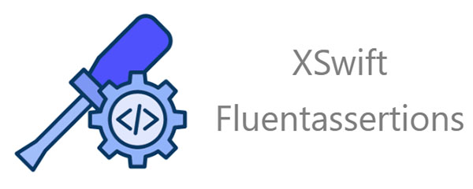

   

 

This package provides some fluent assertion extension methods according to XSwift exceptions and issues.

- [Overview](https://xswift.dev/docs/overview)  
- [Tutorial](https://xswift.dev/docs/tutorial/get-started)  
- [Example](https://github.com/xswift-project/sample-xswift-task-management)  
- [XSwift Fluentassertions reference](https://xswift.dev/docs/category/xswift-fluentassertions) 

Other relevant libraries:  
- [XSwift repository](https://github.com/xswift-project/xswift)  
- [XSwift reference](https://xswift.dev/docs/category/xswift)
- [XSwift Entityframeworkcore repository](https://github.com/xswift-project/xswift-entityframeworkcore)  
- [XSwift Entityframeworkcore reference](https://xswift.dev/docs/category/xswift-entiyframework)